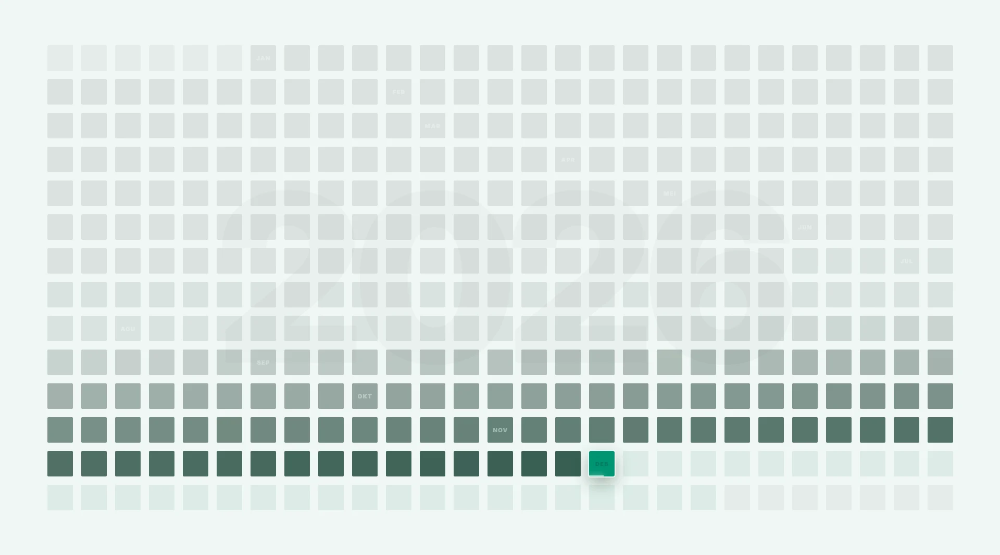

# TRACE
**The Shape of Time.**

> *Time doesn't just pass; it leaves a trace.*

TRACE is not a calendar to manage your appointments. It is a digital instrument designed to visualize the sensation of time passing. By rendering the entire year as a single, high-density landscape, TRACE transforms your screen into a meditative surface that helps you intuitively understand where you stand in the flow of the year.

Designed as **"Digital Furniture,"** it is perfect for filling empty screens in multi-monitor setups, acting as a calm, aesthetic anchor in your workspace. It enhances the aesthetics of your work-setup photos, provides a clear reminder of your journey, and offers a beautiful way to share your progress.

---

### 🌐 The Vision
In a world of notifications and deadlines, we lost the ability to see the "whole." TRACE restores that perspective. It invites you to observe time not as a sequence of demands, but as a fluid journey—where the past is accepted, and the present is vivid.

### 🧠 Psychology & Design Principles
TRACE is built upon specific neuroaesthetic principles to reduce anxiety and promote focus:

* **Temporal Fading (Acceptance):** Past days do not vanish; they desaturate and fade into a "ghostly" state. This visualizes memory—it’s there, but it no longer demands your energy.
* **The Pulse of Now (Focus):** We removed the ticking clock. Instead, a subtle, glowing bar fills up throughout the day, representing energy rather than deadlines.
* **Subliminal Context (Calm):** The year is rendered as a watermark with only a 4% difference in brightness from the background. It provides context without distraction.
* **Fluid Motion (Flow):** Interactions are smoothed with physics-based transitions, ensuring that checking your progress feels like touching water, not hitting a button.

### 🖼️ Use Cases
* **The Second Monitor:** A "Screensaver with Purpose" for moments when you need to clear your mind.
* **Setup Aesthetics:** Enhance the look of your desk for photos and videos of your workspace.
* **Social Progress:** A beautiful, non-intrusive way to visualize and share how much of the year has been traversed.
* **Clear Reminders:** A silent guide that keeps you aware of your place in the year's cycle.

### 🕯️ Interaction Guidelines
TRACE follows a "Zero-UI" philosophy. There are no visible buttons to clutter the view.

1.  **To Change the Mood (Theme):**
    **Long Press (or Click & Hold)** anywhere on the empty background for about 1 second.
    *Why?* This ritual requires intention. It is a moment of pause to shift the atmosphere of your room.
    
2.  **To Explore:**
    **Hover** over any cell to bring it into focus.
    *Why?* The grid remains quiet until you choose to engage with it.

---

### 📦 Installation
TRACE is a standalone web instrument. No installation is required.
1.  Download the `index.html` file.
2.  Open it in any modern web browser.
3.  Press `F11` for Fullscreen mode to complete the immersion.

---