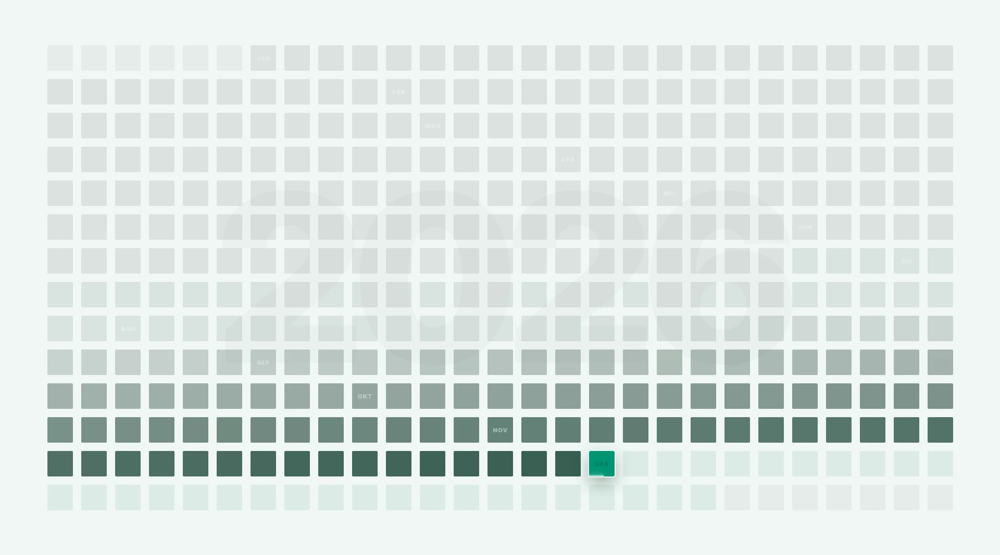

# TRACE
**The Shape of Time.**

> *Time doesn't just pass; it leaves a trace.*



TRACE is not a calendar to manage your appointments. It is a digital instrument designed to visualize the sensation of time passing. By rendering the entire year as a single, high-density landscape, TRACE transforms your screen into a meditative surface that helps you intuitively understand where you stand in the flow of the year.

Designed as **"Digital Furniture,"** it is perfect for filling empty screens in multi-monitor setups, acting as a calm, aesthetic anchor in your workspace. It enhances the aesthetics of work setups for photos, provides clear reminders of the year's progress, and helps you share your journey with others.

---

### 🌐 The Vision
In a world of notifications and deadlines, we lost the ability to see the "whole." TRACE restores that perspective. It invites you to observe time not as a sequence of demands, but as a fluid journey—where the past is accepted, and the present is vivid.

### 🧠 Psychology & Design Principles
TRACE is built upon specific neuroaesthetic principles to reduce anxiety and promote focus:

* **Temporal Fading (Acceptance):** Past days do not vanish; they desaturate and fade into a "ghostly" state. This visualizes memory—it’s there, but it no longer demands your energy.
* **The Pulse of Now (Focus):** We removed the ticking clock. Instead, a subtle, glowing bar fills up throughout the day, representing energy rather than deadlines.
* **Subliminal Context (Calm):** The year is rendered as a watermark with only a 4% difference in brightness from the background. It provides context without distraction.
* **Fluid Motion (Flow):** Interactions are smoothed with physics-based transitions, ensuring that checking your progress feels like touching water, not hitting a button.

### 🖼️ Use Cases
* **Workspace Aesthetics:** A minimalist backdrop that elevates photos of desk setups for social sharing.
* **The Second Monitor:** A "Screensaver with Purpose" for moments when you need to clear your mind.
* **Shared Progress:** A beautiful, non-intrusive way to visualize how much of the year has been traversed.
* **Focus Reminders:** A silent, visual anchor that keeps the bigger picture in mind during daily tasks.

### 🕯️ Interaction Guidelines
TRACE follows a "Zero-UI" philosophy. There are no visible buttons to clutter the view.

1.  **To Change the Mood:**
    **Long Press (or Click & Hold)** anywhere on the empty background for about 1 second.
    *Why?* This ritual requires intention. It is a moment of pause to shift the atmosphere of your room.
    
2.  **To Explore:**
    **Hover** over any cell to bring it into focus.
    *Why?* The grid remains quiet until you choose to engage with it.

3.  **To Find a Day Again:**
    Press `/` and type. Matches rank by relevance, newest first; `↑` `↓` to
    pick and `Enter` to travel there.
    *Why?* A note you cannot find again was never really kept.

4.  **To Record a Day:**
    **Click** a date, then press `Enter` — write a note or pick a mood.
    *Why?* A day worth remembering should cost one gesture, not a form.

### ⌨️ Keyboard

The grid is reachable with `Tab` and follows the WAI-ARIA grid pattern.

| Key | Action |
| --- | --- |
| `Tab` | Enter the calendar |
| `←` `→` `↑` `↓` | Move by day / week |
| `Home` `End` | First / last day of the month |
| `PageUp` `PageDown` | Previous / next month |
| `Enter` `Space` | Open the day panel |
| `F` | Focus today |
| `G` | Jump to a date |
| `/` | Search your notes and moods |
| `Space` | Travel to today |
| `↑` `↓` (no cell focused) | Previous / next year (`Shift` = 10 years) |
| `T` | Toggle theme |
| `E` | Export every recorded day to a JSON file |
| `I` | Import a JSON archive (merges; nothing is overwritten blindly) |
| `M` | Toggle audio |
| `R` / `S` | Dynamic / Monday-aligned layout |

---

### 📦 Running It

TRACE ships as ES modules, so it needs to be served over HTTP — opening
`index.html` straight from disk is blocked by the browser's module CORS rules.

```bash
npm start           # http://127.0.0.1:8000 (no-cache dev server)
```

Any static server works; `devserver.py` simply adds `Cache-Control: no-store`
so an edited module is never masked by a cached copy. Press `F11` for
fullscreen to complete the immersion.

There is no build step and there are no runtime dependencies.

### 💾 Your Data

Notes and moods live in this browser's `localStorage` — nothing is sent
anywhere. That also means clearing site data erases them, so press `E` now and
then to keep a copy. `I` merges an archive back in: days already on screen are
kept unless the file has a newer version of that same day.

### 🧪 Development

```bash
npm test            # unit tests (node:test, no dependencies)
npm run test:watch  # re-run on change
```

See [ARCHITECTURE.md](./ARCHITECTURE.md) for how the modules fit together.

### 📝 Changelog
Refer to the [CHANGELOG.md](./CHANGELOG.md) for technical history and version updates.